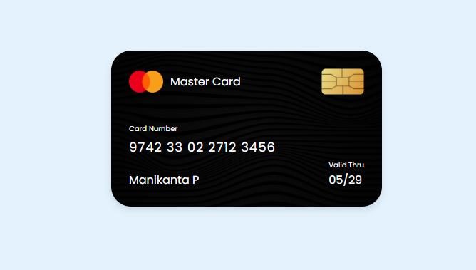

# Credit Card UI Design

This project is a simple credit card UI design created using HTML and CSS. The design includes a background image, card details, and some basic styling to make the card look realistic.

## Features

- Responsive design
- Custom font from Google Fonts
- Background image for the card
- Card details including card number, cardholder name, and validity date
- Card chip image

## Getting Started

To get a copy of the project up and running on your local machine, follow these simple steps.

### Prerequisites

You will need a web browser to open the `index.html` file and view the design.

### Installation

1. Clone the repository
    ```bash
    git clone https://github.com/your-username/credit-card-ui-design.git
    ```
2. Open the project directory
    ```bash
    cd credit-card-ui-design
    ```
3. Open `index.html` in your web browser to view the design.

## Project Structure

credit-card-ui-design/
├── images/
│ ├── bg.png
│ ├── chip.png
│ └── logo.png
├── index.html
└── styles.css

- `images/` directory contains all the images used in the project.
- `index.html` is the main HTML file.
- `styles.css` is the stylesheet for the project.

## Usage

You can customize the card details such as card number, cardholder name, and validity date by modifying the corresponding elements in `index.html`.

## Screenshot



## Contributing

Contributions are welcome! Please feel free to submit a Pull Request.

## License

This project is licensed under the MIT License - see the [LICENSE](LICENSE) file for details.

## Acknowledgments

- The project uses the [Poppins](https://fonts.google.com/specimen/Poppins) font from Google Fonts.
- Card background image from [source].
- Card chip image from [source].
